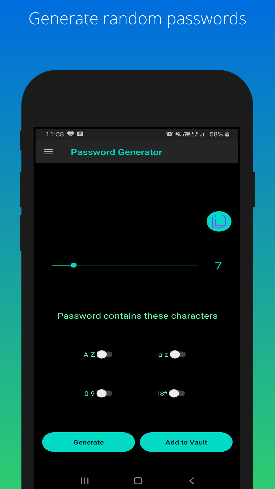
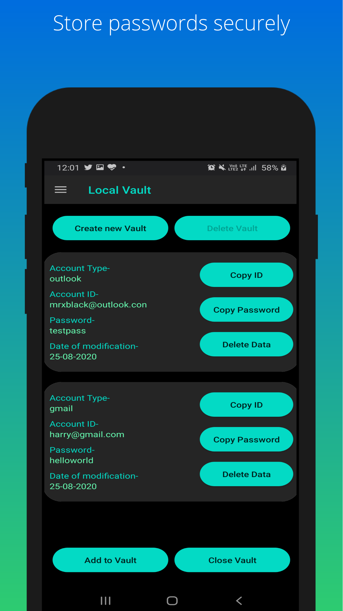
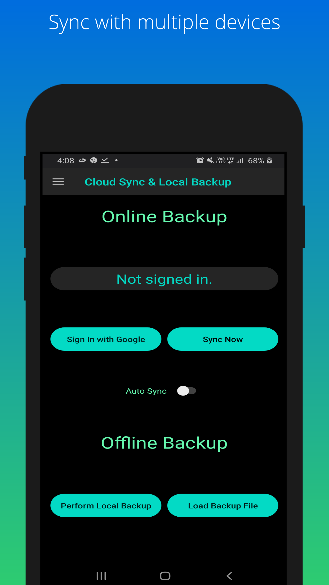
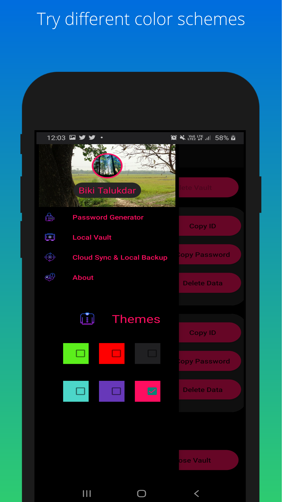

# Password-Generator-And-Manager

Password Generator And Manager is a Free as in Freedom software for managing and generating your passwords. 

Key Features:-
1. Can generate random password of varying length with different sets of characters (A-Z), (a-z), (0-9), (!$*).

2. It used AES encryption to securely store your passwords in vaults.

3. Multiple vaults can be created, each vault can contain different sets of password. Example email vault contains the passwords of email accounts. Social media vault can contain passwords for social media accounts.

4. The app has syncing feature to upload the data to google drive. The data uploaded is fully encrypted.

5. Password Generator and Manager is free as in freedom and covered under GPLv3.

Icons used inside the app (excluding the main app icon) are from Icon8.
Icon8- https://icons8.com/

